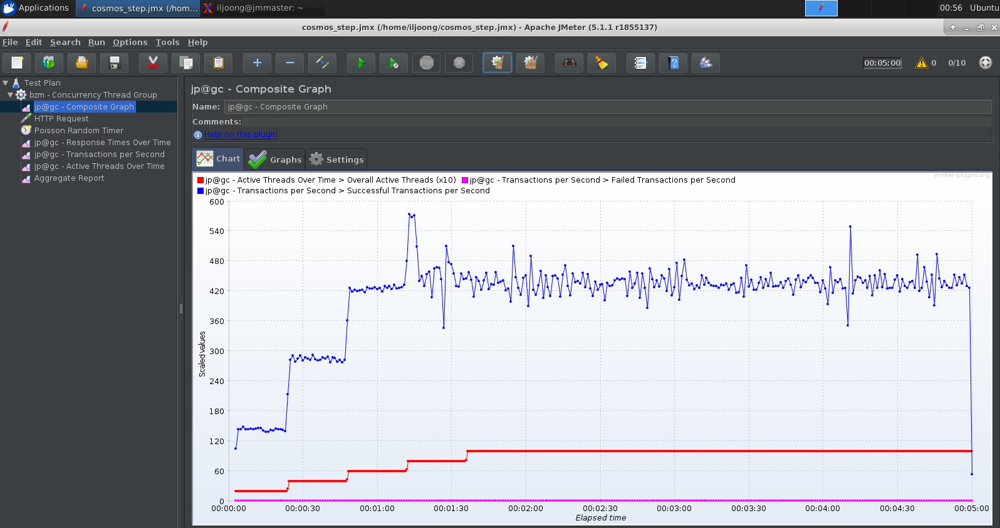
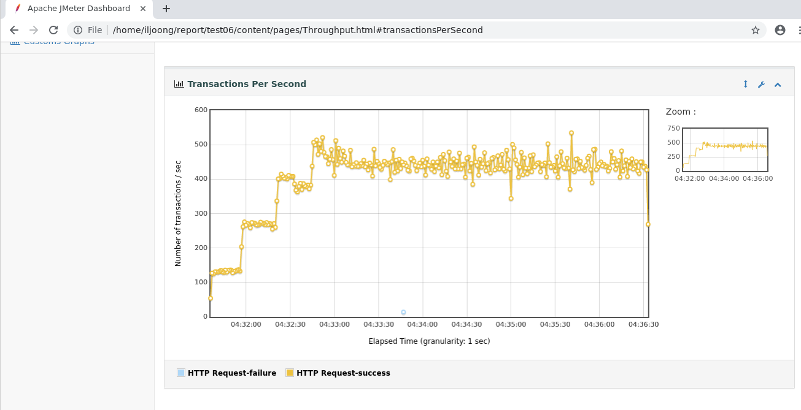

# Step by Step Configuration

## Config Master(Server) VM

Use files in [master](./master) folder to setup a master VM.

1. Install RDP and Ansible

    - Once VMs were all created, connect to master VM and install & setup _RDP_ and _Ansible_.

    > See https://docs.microsoft.com/en-us/azure/virtual-machines/linux/use-remote-desktop for configuring RDP.

2. Install plugins manager

    - Install plugins manager
        ```
        curl -o /home/apache-jmeter-5.1.1/lib/ext/jmeter-plugins-manager-1.3.jar -J -L http://search.maven.org/remotecontent?filepath=kg/apc/jmeter-plugins-manager/1.3/jmeter-plugins-manager-1.3.jar
        ```
        * assuming _JMeter_ is installed in `/home` directory 

3. Install plugins
    - Run `JMeter (GUI mode)` and install necessary plugins like, [Composite Timeline Graph](https://jmeter-plugins.org/wiki/CompositeGraph/), [Concurrency Thread Group](https://jmeter-plugins.org/wiki/ConcurrencyThreadGroup/) and `jpgc - Standard Set` plugins (Options -> Plugins Manager).

4. Prepare JMeter for distributed test
    - Create a new rmi-keystore (`rmi_kestore.jks`) file
    - Update rmi-keystore section in `user.properties` file
    - Update `remote_hosts` in `jmeter.properties` file
    
    > You could use files in sample directory but it is recommended to create your own files. You also need to copy `rmi_kestore.jks` and `user.properties` to all agent VMs. Sample ansible script will copy all the necessary files to agents.

Note that there is a bug with JMeter's `httpclient4`, which does _not reuse connections_. Modify as `httpclient.reset_state_on_thread_group_iteration=false` in `jmeter.properties` file

```
When using the default HTTP Request implementation (HttpClient4), JMeter does not reuse connections even with KeepAlive enabled. This causes the connect time to steadily increase and cause HttpHostConnectExceptions, and it also causes the throughput to drop. This issue is not present in JMeter 4.0.
```
[https://bz.apache.org/bugzilla/show_bug.cgi?id=63110](https://bz.apache.org/bugzilla/show_bug.cgi?id=63110)

### Windows Server

This document provides a guidance for Linux OS. You can also config a master on Windows OS.

> If you're running on Windows, make sure that [Windows Firewall](https://jmeter.apache.org/usermanual/jmeter_distributed_testing_step_by_step.html#tips) is configured so that it can communicate with agents. 

## Config Agents(Slave) VM

Agents can be easily configured with [Ansible](https://www.ansible.com/). 

Update `hosts` and `agent.yaml` in [ansible](./master/ansible) in folder and run ansible script to config agents.

```
ansible-playbook -i hosts agent.yaml
```

> You have to login at least once before run this command. Otherwise, you will get `"ERROR! Using a SSH password instead of a key is not possible because Host Key checking is enabled and sshpass does not support this.  Please add this host's fingerprint to your known_hosts file to manage this host."` error

For a connection test to agents, run following command.

```
ansible -i hosts all -m ping -u <user> [--ask-pass]
```

## Run Load Test

1. Create a Test Plan

Use samples in [testplan](./master/testplan) for simple testing and create your own test plan.

2. Run Test



You can run a load test using GUI mode but it is recommended to run using CLI mode.

To run cli mode, use following sample for local run. 

```
jmeter -n -t sample.jmx -l test01.csv -e -o ./report/test01
```

3. Run Remotely

For remote/distributed load tests, use `-r` option. Make sure that remote agents are all running before executing this command.

```
jmeter -n -r -t sample.jmx -l test01.csv -e -o ./report/test01
```

4. Review Report

After run the test, you will get a report generated. 



See this [link](http://jmeter.apache.org/usermanual/generating-dashboard.html) for more information.
You can also fine-tune the report/dashboard. For example, add/modify `jmeter.reportgenerator.overall_granularity=1000` in `jmeter.properties` to display in 1 sec granularity instead of 1 min.

## References

### Distributed JMeter Config:

- https://medium.com/@yash3x/how-to-setup-distributed-load-testing-with-jmeter-fba703f41a32
- http://www.softwaretestingclass.com/jmeters-distributed-testing-jmeter-tutorials-series-day-10/

### Plugin:

- https://jmeter-plugins.org/install/Install/
- https://jmeter-plugins.org/wiki/CompositeGraph/
- https://www.blazemeter.com/blog/how-to-use-the-composite-graph-plugin-in-jmeter/

### Test:

- Step by step guide: https://www.seleniumeasy.com/jmeter-tutorials/http-request-sampler-example
- Using CSV user data: https://guide.blazemeter.com/hc/en-us/articles/206733689-Using-CSV-DATA-SET-CONFIG
- Optimizing test: https://www.blazemeter.com/blog/what’s-the-max-number-of-users-you-can-test-on-jmeter/

### Youtube

- https://www.youtube.com/playlist?list=PLhW3qG5bs-L-zox1h3eIL7CZh5zJmci4c