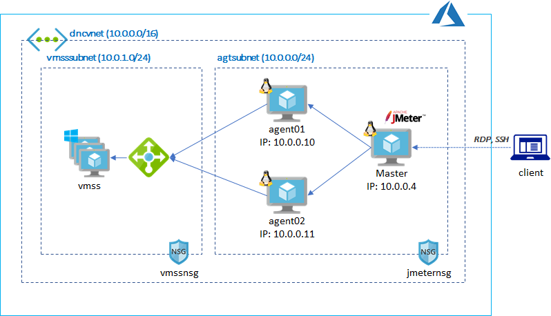

# Terraform for Distributed JMeter Setup  

## JMeter Test Environment in Azure



## Setup

Update variables, such as `subscription_id`, `location`, `rgname` and etc in `variables.tf`.

> Note that this terraform script will be provisioned on existing environment. You may also need to create a new [service principal](https://docs.microsoft.com/en-us/azure/active-directory/develop/howto-create-service-principal-portal) for managing resources.

## Run Terraform

```
terraform init
terraform apply
```

## Config Master and Agents

Please refer [CONFIG.md](./CONFIG.md) for more information.